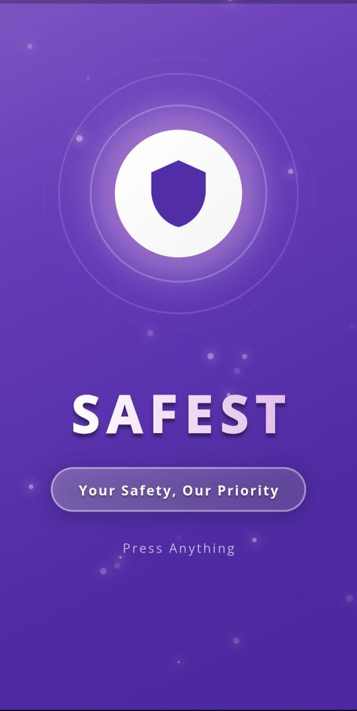
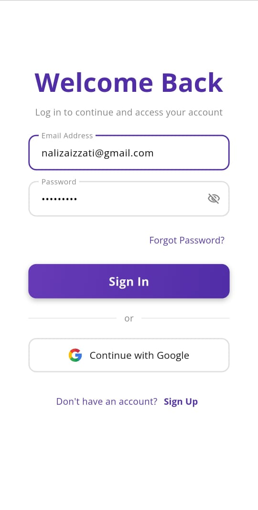
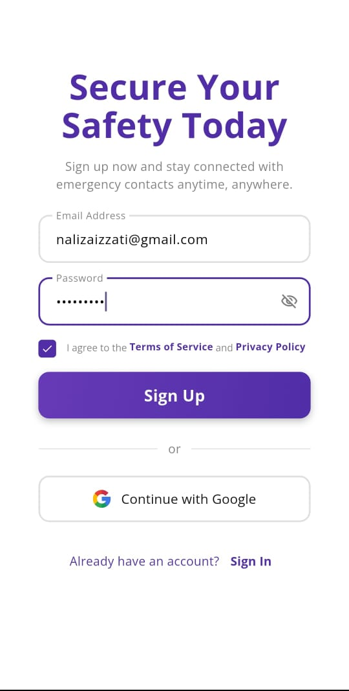
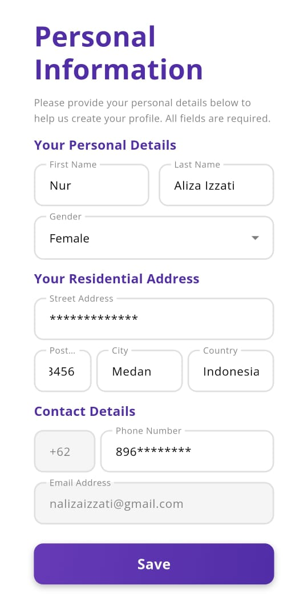
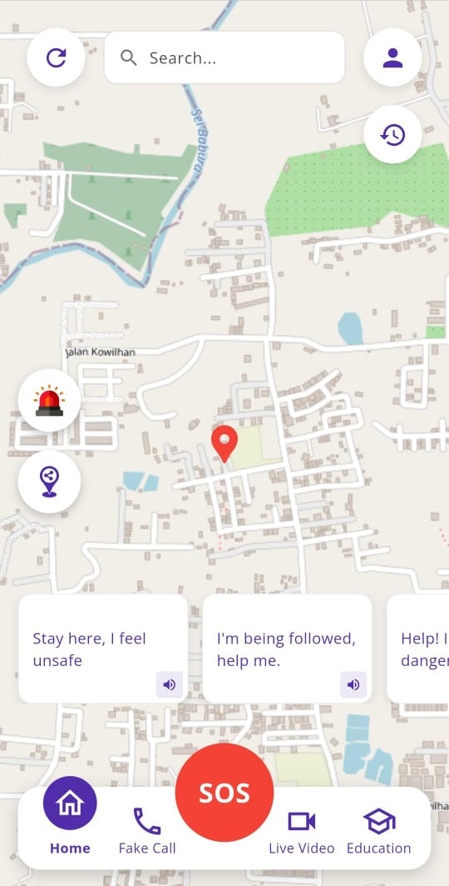
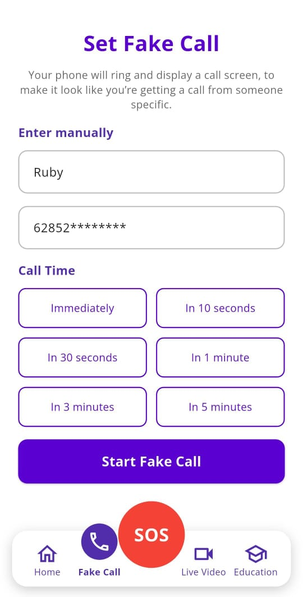
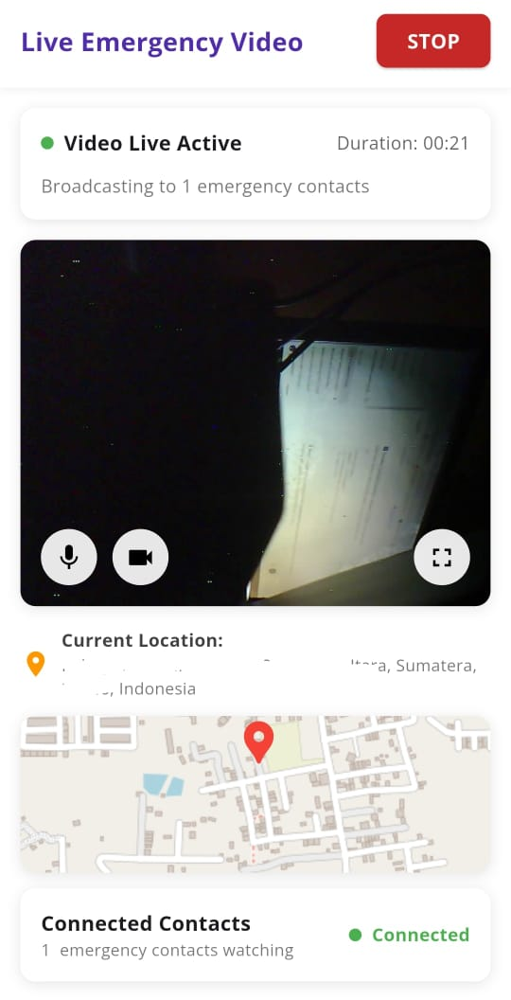
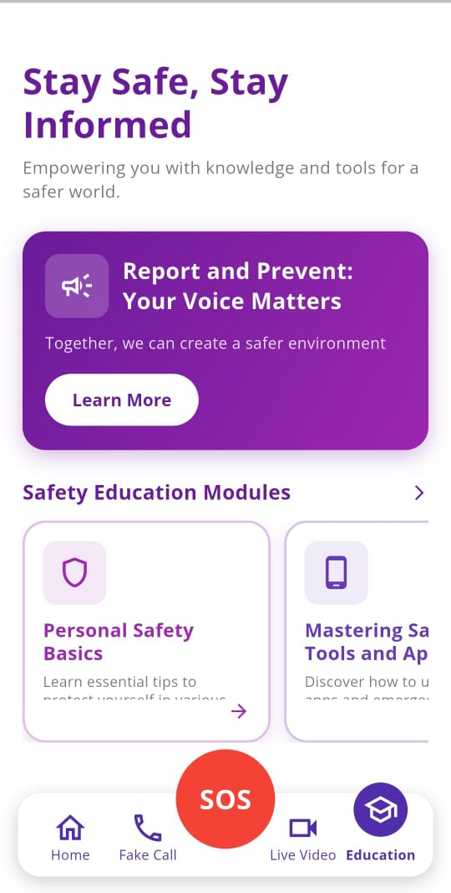
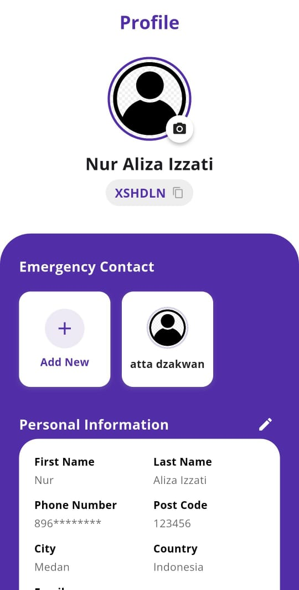
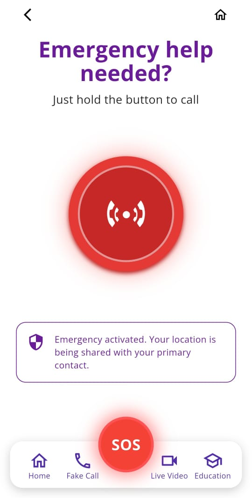

<p align="center">
  
</p>

<h1 align="center">SAFEST - <i>Sexual Assault Free Environtmen with Smart Technology</i></h1>

<p align="center">
  <a href="https://github.com/alizzati/safest/releases"></a>
  <a href="https://flutter.dev"></a>
  <a href="https://firebase.google.com"></a>
  <a href="LICENSE"></a>
</p>

<p align="center">
  <strong>SAFEST</strong> adalah aplikasi keselamatan pribadi yang telah dirilis untuk menjadi pendamping digital Anda di situasi kritis. Aplikasi ini mengintegrasikan fitur darurat <em>real-time</em>, edukasi pertahanan diri, dan alat bantu aksesibilitas untuk memberikan rasa aman kapan pun dan di mana pun.
</p>

<p align="center">
  <a href="#-download--demo"><strong>📥 Download Aplikasi</strong></a> ·
  <a href="#-fitur-utama"><strong>✨ Lihat Fitur</strong></a> ·
  <a href="#-kelompok-fast-graduate-a"><strong>👥 Tim Pengembang</strong></a>
</p>

---

## 📥 Download & Demo

Rilis terbatas aplikasi **SAFEST** **v1.0.0**.

| Platform | Status | Link |
|:---:|:---:|:---|
| **Android** | ✅ Rilis | [**Download APK (v1.0.0)**](https://github.com/alizzati/safest/releases/download/v1.0.0/app-release.apk) |
| **iOS** | 🚧 Beta | *Belum tersedia* |

> *Catatan: Pastikan izin instalasi dari sumber tidak dikenal diaktifkan jika menginstal via APK manual.*

---

## 👥 Kelompok *Fast Graduate* (A)

Project ini disusun untuk memenuhi tugas mata kuliah Pemrograman Mobile.

| No | Nama  | NIM | Peran |
|:--:|:--- |:---:|:---|
| 1. | **Muhammad Dzakwan Attaqiy** | 231401050 | *Fullstack* |
| 2. | **Nur Aliza Izzati** | 231401076 | *Fullstack* |
| 3. | **Khairunnisa Siregar** | 231401118 | *Fullstack* |

---

## ✨ Fitur Utama

Aplikasi ini dilengkapi dengan berbagai fitur keamanan canggih:

### 🗣️ Help Me Speak
Fitur aksesibilitas berupa *text-to-speech* (teks box bersuara). Dirancang khusus untuk membantu pengguna tuna wicara atau pengguna yang dalam situasi tidak bisa berbicara untuk meminta bantuan melalui suara sintesis.

### 📞 Fake Call (Panggilan Palsu)
Terjebak dalam situasi canggung atau mencurigakan? Gunakan fitur ini untuk mensimulasikan panggilan masuk yang terlihat nyata, memberikan alasan logis untuk segera pergi dari lokasi tersebut.

### 📹 Live Emergency Video + Live Location
Dalam keadaan darurat, aplikasi dapat mengirimkan *streaming* video situasi sekitar secara langsung kepada kontak darurat, disertai dengan pelacakan lokasi *real-time* yang akurat.

### 🚨 Emergency Siren
Membunyikan alarm/sirene dengan volume tinggi untuk menarik perhatian orang sekitar dan menakuti pelaku kejahatan saat terjadi ancaman fisik.

### 📍 Share Location
Membagikan lokasi terkini kepada teman atau keluarga dengan satu ketukan, memastikan orang terdekat mengetahui keberadaan Anda saat bepergian.

### 🆘 SOS Button
Tombol darurat instan yang akan langsung menghubungkan (menelepon) kontak darurat yang telah didaftarkan sebelumnya.

### 📚 Educa (Safety Education)
Modul edukasi yang berisi panduan, artikel, dan tips keselamatan diri untuk meningkatkan kesadaran (*awareness*) pengguna terhadap potensi bahaya.

### 👤 Personal Information & Contacts
Manajemen profil pengguna yang fleksibel. Memungkinkan pengguna untuk menambahkan teman atau keluarga ke dalam daftar kontak darurat menggunakan **ID Unik** atau **Nomor Telepon**.

---

## 📱 Tampilan Aplikasi

| Splash Screen | Sign In | Sign Up | Personal Info |
|:---:|:---:|:---:|:---:|
|  |  |  |  |
| Home Screen | Fake Call | Live Video | Educa |
|  |  |  |  |
| Profile Screen | Add Contact by Id | SOS Button | |
|  |  |  |  |

---

## 🛠️ Teknologi yang Digunakan
Aplikasi ini dibangun sepenuhnya menggunakan ekosistem Flutter yang modern dan *scalable*:

* **Core Framework:** [Flutter](https://flutter.dev) (Dart)
* **Backend & Database:**
    * **Firebase Authentication:** Manajemen login & registrasi yang aman.
    * **Cloud Firestore:** Database *NoSQL* real-time untuk data pengguna dan kontak.
    * **Firebase Storage:** Penyimpanan media (foto profil, bukti rekaman, dll).
* **Key Packages & Libraries:**
    * `go_router`: Manajemen navigasi antar halaman.
    * `flutter_map` & `geolocator`: Layanan peta dan pelacakan lokasi.
    * `camera`: Akses kamera untuk fitur Live Video.
    * `audioplayers`: Pemutar suara untuk fitur Sirene dan Fake Call.
---

## 🚀 Cara Instalasi

1.  **Clone Repository**
    ```bash
    git clone [https://github.com/alizzati/safest.git](https://github.com/alizzati/safest.git)
    ```

2.  **Masuk ke Direktori**
    ```bash
    cd safest
    ```

3.  **Install Dependencies**
    ```bash
    flutter pub get
    ```

4.  **Jalankan Aplikasi**
    Pastikan emulator atau device fisik sudah terhubung.
    ```bash
    flutter run
    ```
